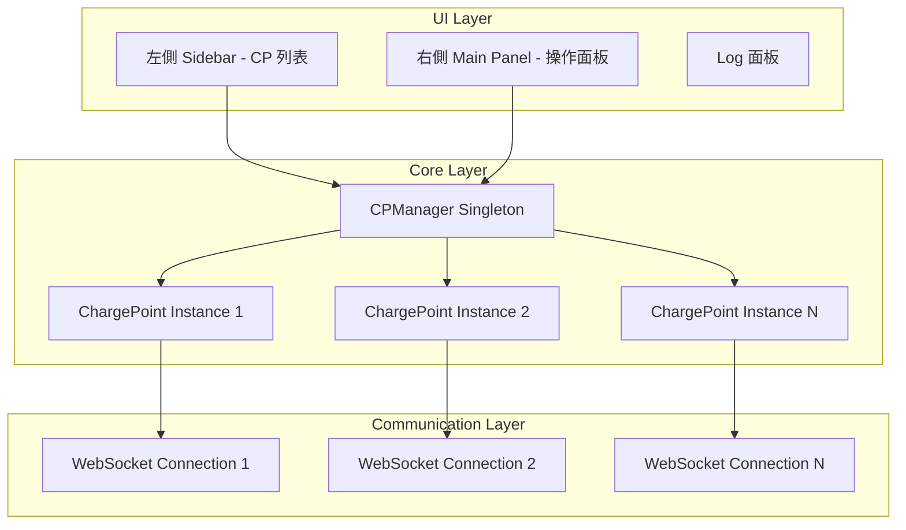

# OCPP 1.6 Simulator - 完整工項列表 (Work Breakdown Structure)

> 此專案目標為建立一個「完整支援 OCPP 1.6」且「多充電樁」的模擬器，採用物件導向 (OOP) 設計確保每個充電樁實例獨立運作。

## 💡 技術選型

**純 HTML + JavaScript + CSS** - 零依賴、零建置工具

- ✅ 雙擊 `index.html` 即可在瀏覽器中運行
- ✅ 無需 Node.js、npm、或任何建置步驟
- ✅ 使用 ES6+ 原生語法 (class, async/await, modules)
- ✅ 現代瀏覽器 100% 支援

---

## 架構概覽



---

## Phase 0: 核心架構設計 (Architecture Foundation)

> **目標**：建立能支撐「多樁」的核心架構基礎

### 0.1 Class 設計
- [x] 建立 `ChargePoint` Class
  - 屬性：`id`, `serverUrl`, `ws`, `state`, `transactionId`, `configuration`, `connectorId`
  - 每個 `new ChargePoint(cpId, serverUrl)` 都是獨立物件
  - 擁有自己的 WebSocket 連線、狀態機與配置檔

### 0.2 Manager 設計
- [x] 建立 `CPManager` Singleton
  - 管理所有 CP 實例的生命週期
  - 提供批量操作 API (批量連線、斷線、發送指令)
  - 維護當前選定的 CP 供 UI 顯示

### 0.3 事件系統
- [x] 設計 EventEmitter 機制
  - CP 狀態變更時觸發 UI 更新
  - Log 訊息統一處理

---

## Phase 1: 基礎架構與多樁管理 (Infrastructure & Multi-CP)

> **目標**：同時模擬 10+ 支樁連線，並能獨立發送 Heartbeat

### 1.1 UI 框架搭建
- [x] 建立左側 Sidebar
  - 顯示 CP 列表 (如 CP001, CP002...)
  - 連線狀態燈號 (綠/黃/紅)
  - 點選切換當前操作的 CP

- [x] 建立右側 Main Panel
  - 顯示「當前選定 CP」的操作面板
  - 顯示 CP 基本資訊 (狀態、連線時間、交易 ID 等)

- [x] 建立 Log 面板
  - 即時顯示 WebSocket 訊息 (tx/rx)
  - 支援按 CP 篩選

- [x] 建立「新增充電樁」功能
  - 輸入 ID 與 Server URL
  - 動態產生 CP 物件並加入列表

### 1.2 核心通訊模組 (OCPP-J WebSocket)
- [x] 實作 `OCPPWebSocket` Class
  - 封裝 `new WebSocket(url, "ocpp1.6")`
  - 自動重連機制 (exponential backoff)

- [x] 實作 Protocol 封包標準化
  - Message Types:
    - `[2, "UniqueId", "Action", {Payload}]` - CALL
    - `[3, "UniqueId", {Payload}]` - CALLRESULT
    - `[4, "UniqueId", "ErrorCode", "ErrorDescription", {Details}]` - CALLERROR

- [x] 實作 Promise-based Request
  - `await this.send('BootNotification', payload)` 直接取得回應
  - Request timeout 處理
  - 維護 pending requests Map

### 1.3 基礎連線流程
- [x] 實作 `BootNotification`
  - Payload: `chargePointVendor`, `chargePointModel`, `chargePointSerialNumber`, `firmwareVersion`, `iccid`, `imsi`, `meterType`, `meterSerialNumber`
  - 處理回應 `status` (Accepted/Pending/Rejected)
  - 記錄 Server 回傳的 `interval`

- [x] 實作 `Heartbeat`
  - 每個 CP 實例擁有獨立的 `setInterval`
  - 根據 `HeartbeatInterval` 配置動態調整

---

## Phase 2: 核心充電業務 (Core Profile)

> **OCPP 1.6 Core Profile** - 必備功能

### 2.1 狀態機 (Connector State Machine)
- [x] 定義狀態 Enum
  ```
  Available    - 可用
  Preparing    - 準備中 (插槍後)
  Charging     - 充電中
  SuspendedEV  - EV 暫停
  SuspendedEVSE - EVSE 暫停
  Finishing    - 結束中
  Reserved     - 已預約
  Unavailable  - 不可用
  Faulted      - 故障
  ```

- [x] 實作 `StatusNotification`
  - 當狀態改變時自動發送給 Server
  - 包含 `connectorId`, `errorCode`, `status`, `timestamp`
  - 支援 `info`, `vendorId`, `vendorErrorCode` 可選欄位

### 2.2 授權與啟動 (Authorization & Start)
- [x] UI 實作
  - RFID 卡號輸入框
  - 「刷卡」按鈕 (送 Authorize)
  - 「插槍」按鈕 (模擬連接器狀態變更)

- [x] 實作 `Authorize` Request
  - 發送 `idTag`
  - 處理回應 `idTagInfo` (status, expiryDate, parentIdTag)

- [x] 實作 `StartTransaction`
  - Payload: `connectorId`, `idTag`, `meterStart`, `timestamp`
  - 可選: `reservationId`
  - 處理 Server 回傳的 `transactionId` 並儲存至該 CP 實例
  - 狀態轉為 `Charging`

### 2.3 充電中與結束 (Charging & Stop)
- [x] 實作 `MeterValues` 產生器
  - 支援 Measurands (量測值):
    - `Energy.Active.Import.Register` (Wh) - 累計電量
    - `Power.Active.Import` (W) - 即時功率
    - `Current.Import` (A) - 電流
    - `Voltage` (V) - 電壓
    - `SoC` (%) - 電池電量 (選用)
    - `Temperature` (攝氏) - 溫度 (選用)
  - 可配置採樣週期 (`MeterValueSampleInterval`)
  - 模擬隨機波動或線性增加

- [x] 實作 `StopTransaction`
  - Payload: `meterStop`, `timestamp`, `transactionId`
  - `reason` 列舉: `Local`, `Remote`, `EVDisconnected`, `HardReset`, `SoftReset`, `DeAuthorized`, `Reboot`, `PowerLoss`, `EmergencyStop`, `Other`
  - 可選: `idTag`, `transactionData` (最終 MeterValues)

### 2.4 資料傳輸 (Data Transfer)
- [x] 實作 `DataTransfer` (CP 發起)
  - Payload: `vendorId`, `messageId` (選用), `data` (選用)
  - 用於廠商自定義擴展

---

## Phase 3: 遠端控制回應 (Remote Trigger Profile)

> **OCPP 1.6 Remote Trigger** - Server 主動呼叫 CP

### 3.1 遠端啟停 (Remote Commands)
- [x] 實作 `RemoteStartTransaction` Handler
  - 接收: `idTag`, `connectorId` (選用), `chargingProfile` (選用)
  - 回應: `Accepted` / `Rejected`
  - 收到後自動觸發 Authorize → StartTransaction 流程

- [x] 實作 `RemoteStopTransaction` Handler
  - 接收: `transactionId`
  - 回應: `Accepted` / `Rejected`
  - 收到後自動觸發 StopTransaction

- [x] 實作 `UnlockConnector`
  - 接收: `connectorId`
  - 回應: `Unlocked` / `UnlockFailed` / `NotSupported`
  - 模擬解鎖槍頭成功/失敗

### 3.2 重置與配置 (Reset & Configuration)
- [x] 實作 `Reset` Handler
  - 類型: `Soft` / `Hard`
  - `Soft`: 模擬斷線重連，維持配置
  - `Hard`: 清除所有狀態，模擬完全重啟

- [x] 實作 Configuration Store (Key-Value Map)
  - 預設 ConfigurationKey 列表:
    ```
    HeartbeatInterval
    ConnectionTimeOut
    ResetRetries
    MeterValueSampleInterval
    ClockAlignedDataInterval
    MeterValuesAlignedData
    MeterValuesSampledData
    StopTransactionOnInvalidId
    StopTransactionOnEVSideDisconnect
    LocalPreAuthorize
    LocalAuthorizeOffline
    AllowOfflineTxForUnknownId
    AuthorizationCacheEnabled
    AuthorizeRemoteTxRequests
    MinimumStatusDuration
    StopTxnSampledData
    StopTxnAlignedData
    SupportedFeatureProfiles
    ```

- [x] 實作 `GetConfiguration` Handler
  - 接收: `key` (選用，空則返回全部)
  - 回應: `configurationKey[]`, `unknownKey[]`

- [x] 實作 `ChangeConfiguration` Handler
  - 接收: `key`, `value`
  - 回應: `Accepted` / `Rejected` / `RebootRequired` / `NotSupported`

### 3.3 可用性控制 (Availability)
- [x] 實作 `ChangeAvailability` Handler
  - 接收: `connectorId`, `type` (Operative/Inoperative)
  - 回應: `Accepted` / `Rejected` / `Scheduled`
  - 影響 StatusNotification

### 3.4 觸發訊息 (Trigger Message)
- [x] 實作 `TriggerMessage` Handler
  - 支援觸發:
    - `BootNotification`
    - `Heartbeat`
    - `StatusNotification`
    - `MeterValues`
    - `DiagnosticsStatusNotification`
    - `FirmwareStatusNotification`
  - 回應: `Accepted` / `Rejected` / `NotImplemented`

---

## Phase 4: 智慧充電 (Smart Charging Profile)

> **OCPP 1.6 Smart Charging** - 優化電力分配

### 4.1 充電配置管理
- [x] 實作 `SetChargingProfile` Handler
  - 接收並儲存 Server 下發的 ChargingProfile
  - Profile 結構:
    ```
    chargingProfileId
    transactionId (選用)
    stackLevel
    chargingProfilePurpose (ChargePointMaxProfile/TxDefaultProfile/TxProfile)
    chargingProfileKind (Absolute/Recurring/Relative)
    recurrencyKind (Daily/Weekly, 選用)
    validFrom / validTo (選用)
    chargingSchedule:
      - duration (選用)
      - startSchedule (選用)
      - chargingRateUnit (A/W)
      - chargingSchedulePeriod[]:
        - startPeriod
        - limit
        - numberPhases (選用)
      - minChargingRate (選用)
    ```

- [x] 實作 `ClearChargingProfile` Handler
  - 接收: `id`, `connectorId`, `chargingProfilePurpose`, `stackLevel` (均可選)
  - 回應: `Accepted` / `Unknown`

- [x] 實作 `GetCompositeSchedule` Handler
  - 接收: `connectorId`, `duration`, `chargingRateUnit` (選用)
  - 回應: 計算後的合成充電排程

### 4.2 智慧充電模擬
- [x] MeterValues 產生器整合 ChargingProfile
  - 根據當前有效的 Profile 限制輸出功率
  - 模擬實際充電行為

---

## Phase 5: 韌體更新模擬 (Firmware Management Profile)

### 5.1 韌體更新
- [x] 實作 `UpdateFirmware` Handler
  - 接收: `location` (URL), `retrieveDate`, `retries` (選用), `retryInterval` (選用)
  - 模擬下載過程 (setTimeout 延遲)

- [x] 實作 `FirmwareStatusNotification`
  - 狀態流程: `Downloading` → `Downloaded` → `Installing` → `Installed`
  - 失敗狀態: `DownloadFailed`, `InstallationFailed`
  - 空閒狀態: `Idle`

### 5.2 診斷上傳
- [x] 實作 `GetDiagnostics` Handler
  - 接收: `location` (上傳 URL), `startTime`, `stopTime`, `retries`, `retryInterval`
  - 模擬上傳診斷檔案

- [x] 實作 `DiagnosticsStatusNotification`
  - 狀態: `Idle`, `Uploading`, `Uploaded`, `UploadFailed`

---

## Phase 6: 本地授權列表 (Local Auth List Profile)

### 6.1 本地列表管理
- [x] 實作 `GetLocalListVersion` Handler
  - 回應當前 localAuthList 版本號

- [x] 實作 `SendLocalList` Handler
  - 接收: `listVersion`, `localAuthorizationList[]`, `updateType` (Differential/Full)
  - 儲存至本地 localStorage 或 IndexedDB

### 6.2 離線授權
- [ ] 實作離線模式邏輯
  - 斷網時使用 Local Auth List 驗證
  - 斷網時的 StopTransaction 存入 localStorage
  - 連線恢復後自動補傳未送出的交易

---

## Phase 7: 預約功能 (Reservation Profile)

### 7.1 預約管理
- [x] 實作 `ReserveNow` Handler
  - 接收: `connectorId`, `expiryDate`, `idTag`, `parentIdTag` (選用), `reservationId`
  - 回應: `Accepted`, `Faulted`, `Occupied`, `Rejected`, `Unavailable`
  - 設定連接器狀態為 `Reserved`

- [x] 實作 `CancelReservation` Handler
  - 接收: `reservationId`
  - 回應: `Accepted` / `Rejected`

### 7.2 預約使用
- [x] StartTransaction 整合預約
  - 支援 `reservationId` 驗證
  - 預約到期自動取消 (Timer)

---

## Phase 8: 安全性相關 (Security - OCPP 1.6 附錄)

### 8.1 基礎安全
- [ ] 實作 WebSocket Secure (wss://) 支援
- [ ] Basic Auth 支援 (HTTP Header)

### 8.2 憑證管理 (選用)
- [ ] 實作 `ExtendedTriggerMessage` (Security Whitepaper)
  - `SignCertificate`
- [ ] 實作 `CertificateSigned` Handler
- [ ] 實作 `SignCertificate` Request

---

## Phase 9: 批量測試與優化 (Testing & Optimization)

### 9.1 批量測試工具
- [x] 實作「一鍵全體連線/斷線」按鈕
- [ ] 實作「一鍵全體送 Heartbeat」
- [ ] 實作「壓力測試模式」
  - 讓所有 CP 隨機進行 Start/Stop
  - 可設定交易頻率
  - 測試 Server 負載

### 9.2 情境模擬
- [ ] 預設測試情境
  - 正常充電流程 (Authorize → Start → MeterValues → Stop)
  - 異常斷電流程 (PowerLoss)
  - 預約充電流程
  - 遠端啟動流程

### 9.3 Log 系統優化
- [x] 實作 Log 過濾器
  - 依 CP 篩選
  - 依 Action 類型篩選
  - 依訊息方向 (tx/rx) 篩選
  - 只看 Error

- [x] 實作 Log 匯出功能
  - 下載成 `.txt` / `.json`
  - 包含時間戳記

### 9.4 效能優化
- [ ] 虛擬列表 (Virtual Scrolling) - Log 大量資料
- [ ] Web Worker - 大量 CP 的 MeterValues 計算

---

## OCPP 1.6 Message 完整對照表

> ✅ = 已規劃在工項中

### CP → Server (Charge Point 發起)

| Message | Profile | 規劃狀態 |
|---------|---------|---------|
| Authorize | Core | ✅ Phase 2.2 |
| BootNotification | Core | ✅ Phase 1.3 |
| DataTransfer | Core | ✅ Phase 2.4 |
| DiagnosticsStatusNotification | FirmwareManagement | ✅ Phase 5.2 |
| FirmwareStatusNotification | FirmwareManagement | ✅ Phase 5.1 |
| Heartbeat | Core | ✅ Phase 1.3 |
| MeterValues | Core | ✅ Phase 2.3 |
| StartTransaction | Core | ✅ Phase 2.2 |
| StatusNotification | Core | ✅ Phase 2.1 |
| StopTransaction | Core | ✅ Phase 2.3 |

### Server → CP (Central System 發起)

| Message | Profile | 規劃狀態 |
|---------|---------|---------|
| CancelReservation | Reservation | ✅ Phase 7.1 |
| ChangeAvailability | Core | ✅ Phase 3.3 |
| ChangeConfiguration | Core | ✅ Phase 3.2 |
| ClearCache | Core | ⚠️ 補充於下方 |
| ClearChargingProfile | SmartCharging | ✅ Phase 4.1 |
| DataTransfer | Core | ⚠️ 補充於下方 |
| GetCompositeSchedule | SmartCharging | ✅ Phase 4.1 |
| GetConfiguration | Core | ✅ Phase 3.2 |
| GetDiagnostics | FirmwareManagement | ✅ Phase 5.2 |
| GetLocalListVersion | LocalAuthListManagement | ✅ Phase 6.1 |
| RemoteStartTransaction | Core | ✅ Phase 3.1 |
| RemoteStopTransaction | Core | ✅ Phase 3.1 |
| ReserveNow | Reservation | ✅ Phase 7.1 |
| Reset | Core | ✅ Phase 3.2 |
| SendLocalList | LocalAuthListManagement | ✅ Phase 6.1 |
| SetChargingProfile | SmartCharging | ✅ Phase 4.1 |
| TriggerMessage | RemoteTrigger | ✅ Phase 3.4 |
| UnlockConnector | Core | ✅ Phase 3.1 |
| UpdateFirmware | FirmwareManagement | ✅ Phase 5.1 |

---

## 補充工項 (原列表未涵蓋)

> 為達成「Fully Support OCPP 1.6」，以下功能需補充：

### 補充 A: ClearCache Handler
- [ ] 實作 `ClearCache` Handler
  - 清除本地授權快取
  - 回應: `Accepted` / `Rejected`

### 補充 B: DataTransfer Handler (Server 發起)
- [ ] 實作 `DataTransfer` Handler (接收端)
  - 處理 Server 發起的 DataTransfer
  - 回應: `Accepted` / `Rejected` / `UnknownMessageId` / `UnknownVendorId`

### 補充 C: 多連接器支援
- [ ] 每個 CP 支援多個 Connector (connectorId: 0, 1, 2...)
  - connectorId = 0 代表整個 CP
  - 每個 Connector 有獨立狀態機
  - UI 可切換查看不同 Connector

### 補充 D: Clock-Aligned MeterValues
- [ ] 實作與時間對齊的 MeterValues
  - 根據 `ClockAlignedDataInterval` 配置
  - 每分鐘/每 15 分鐘整點發送

### 補充 E: 錯誤碼處理
- [ ] 實作 CALLERROR 處理
  - 錯誤碼: `NotImplemented`, `NotSupported`, `InternalError`, `ProtocolError`, `SecurityError`, `FormationViolation`, `PropertyConstraintViolation`, `OccurenceConstraintViolation`, `TypeConstraintViolation`, `GenericError`

### 補充 F: 連線重試機制
- [ ] 實作指數退避重連
  - 初始延遲、最大延遲、重試次數配置

---

## 建議實作順序

```
Phase 0 → Phase 1 → Phase 2 → Phase 3 → Phase 9 (基礎)
    ↓
Phase 4 (Smart Charging) ← 優先度中
    ↓
Phase 5 (Firmware) ← 優先度中
Phase 6 (Local Auth) ← 優先度中
Phase 7 (Reservation) ← 優先度低
    ↓
Phase 8 (Security) ← 視需求
    ↓
補充工項 A~F ← 穿插各階段完成
```

---

## 專案結構 (純 HTML/JS/CSS)

```
ocpp_simulator/
├── index.html              # 主入口頁面
├── css/
│   ├── main.css            # 主要樣式
│   ├── sidebar.css         # 左側 CP 列表樣式
│   ├── panel.css           # 右側操作面板樣式
│   └── log.css             # Log 面板樣式
├── js/
│   ├── app.js              # 應用程式入口 & 初始化
│   ├── core/
│   │   ├── ChargePoint.js  # 充電樁核心 Class
│   │   ├── CPManager.js    # 多樁管理 Singleton
│   │   ├── OCPPProtocol.js # OCPP-J 封包處理
│   │   └── EventBus.js     # 簡易事件系統
│   ├── handlers/
│   │   ├── CoreProfile.js      # Core Profile 訊息處理
│   │   ├── SmartCharging.js    # Smart Charging 處理
│   │   ├── FirmwareManagement.js
│   │   ├── LocalAuthList.js
│   │   └── Reservation.js
│   ├── ui/
│   │   ├── Sidebar.js      # 左側 CP 列表 UI
│   │   ├── MainPanel.js    # 右側操作面板 UI
│   │   ├── LogPanel.js     # Log 面板 UI
│   │   └── Modals.js       # 對話框 (新增 CP 等)
│   └── utils/
│       ├── helpers.js      # 工具函數 (UUID, 時間格式化)
│       └── constants.js    # 常數定義 (狀態、錯誤碼)
└── README.md               # 使用說明
```

---

## 技術棧 (純原生，無依賴)

| 層級 | 技術 | 說明 |
|------|------|------|
| **UI** | HTML5 + CSS3 | 語意化標籤、CSS Grid/Flexbox 佈局 |
| **邏輯** | Vanilla JavaScript (ES6+) | class, async/await, Map, Set |
| **通訊** | Native WebSocket API | 瀏覽器原生支援 |
| **模組化** | ES Modules (import/export) | 使用 `<script type="module">` |
| **狀態管理** | Class 內部狀態 + 自製 EventBus | 無需 Redux/Vuex |
| **持久化** | localStorage | 儲存 CP 配置、Local Auth List |
| **UUID** | `crypto.randomUUID()` | 瀏覽器原生 API |
| **時間** | `Date` / `Intl.DateTimeFormat` | 原生 API，無需 dayjs |

---

## 執行方式

### 方法一：直接開啟 (適用大部分情況)
```
雙擊 index.html → 瀏覽器自動開啟
```

### 方法二：本地伺服器 (ES Modules 需要)

> ⚠️ 如果使用 ES Modules (`import/export`)，Chrome 會因為 CORS 限制而無法直接開啟 file://。
> 需要啟動一個簡易 HTTP 伺服器：

**選項 A - Python (內建)**
```bash
cd ocpp_simulator
python -m http.server 8080
# 開啟 http://localhost:8080
```

**選項 B - Node.js (如果有安裝)**
```bash
npx serve .
# 或
npx http-server .
```

**選項 C - VS Code Live Server 擴展**
- 安裝 "Live Server" 擴展
- 右鍵 index.html → "Open with Live Server"

### 方法三：無模組版本 (最簡單)

如果想完全避免 CORS 問題，可以將所有 JS 合併到一個檔案，不使用 ES Modules：
```html
<script src="js/bundle.js"></script>
```

---

## Class 結構建議

```javascript
// ===== js/core/ChargePoint.js =====
export class ChargePoint {
    constructor(id, serverUrl, options = {}) {
        this.id = id;
        this.url = serverUrl;
        this.ws = null;
        this.connectors = new Map(); // connectorId -> ConnectorState
        this.transactionId = null;
        this.configuration = new Map();
        this.localAuthList = new Map();
        this.chargingProfiles = [];
        this.reservations = new Map();
        this.pendingRequests = new Map(); // msgId -> {resolve, reject, timeout}
        
        this._initConfiguration();
        this._initConnectors(options.connectorCount || 1);
    }

    // === 連線管理 ===
    connect() { /* ... */ }
    disconnect() { /* ... */ }
    
    // === 訊息處理 ===
    _handleMessage(event) { /* Parse and route */ }
    _handleCall(msgId, action, payload) { /* Server → CP */ }
    _handleCallResult(msgId, payload) { /* Response to our request */ }
    _handleCallError(msgId, errorCode, errorDesc, details) { /* Error */ }
    
    // === CP 發起的請求 ===
    async sendBootNotification() { /* ... */ }
    async sendHeartbeat() { /* ... */ }
    async sendAuthorize(idTag) { /* ... */ }
    async sendStartTransaction(connectorId, idTag, meterStart) { /* ... */ }
    async sendStopTransaction(meterStop, reason) { /* ... */ }
    async sendMeterValues(connectorId, values) { /* ... */ }
    async sendStatusNotification(connectorId, status, errorCode) { /* ... */ }
    async sendDataTransfer(vendorId, messageId, data) { /* ... */ }
    async sendDiagnosticsStatusNotification(status) { /* ... */ }
    async sendFirmwareStatusNotification(status) { /* ... */ }
    
    // === Server 指令 Handlers ===
    handleRemoteStartTransaction(payload, msgId) { /* ... */ }
    handleRemoteStopTransaction(payload, msgId) { /* ... */ }
    handleReset(payload, msgId) { /* ... */ }
    handleUnlockConnector(payload, msgId) { /* ... */ }
    handleGetConfiguration(payload, msgId) { /* ... */ }
    handleChangeConfiguration(payload, msgId) { /* ... */ }
    handleChangeAvailability(payload, msgId) { /* ... */ }
    handleTriggerMessage(payload, msgId) { /* ... */ }
    handleSetChargingProfile(payload, msgId) { /* ... */ }
    handleClearChargingProfile(payload, msgId) { /* ... */ }
    handleGetCompositeSchedule(payload, msgId) { /* ... */ }
    handleUpdateFirmware(payload, msgId) { /* ... */ }
    handleGetDiagnostics(payload, msgId) { /* ... */ }
    handleGetLocalListVersion(payload, msgId) { /* ... */ }
    handleSendLocalList(payload, msgId) { /* ... */ }
    handleReserveNow(payload, msgId) { /* ... */ }
    handleCancelReservation(payload, msgId) { /* ... */ }
    handleClearCache(payload, msgId) { /* ... */ }
    handleDataTransfer(payload, msgId) { /* ... */ }
}

// ===== js/core/CPManager.js =====
export class CPManager {
    static #instance = null;
    
    static getInstance() {
        if (!CPManager.#instance) {
            CPManager.#instance = new CPManager();
        }
        return CPManager.#instance;
    }
    
    constructor() {
        if (CPManager.#instance) {
            throw new Error('Use CPManager.getInstance()');
        }
        this.chargePoints = new Map(); // cpId -> ChargePoint
        this.selectedCPId = null;
        this.eventListeners = new Map();
    }
    
    addChargePoint(id, serverUrl, options) { /* ... */ }
    removeChargePoint(id) { /* ... */ }
    getChargePoint(id) { /* ... */ }
    getAllChargePoints() { /* ... */ }
    
    // Batch operations
    connectAll() { /* ... */ }
    disconnectAll() { /* ... */ }
    sendHeartbeatAll() { /* ... */ }
    
    // Event system
    on(event, callback) { /* ... */ }
    emit(event, data) { /* ... */ }
}

// ===== js/core/EventBus.js =====
export class EventBus {
    constructor() {
        this.listeners = new Map();
    }
    
    on(event, callback) {
        if (!this.listeners.has(event)) {
            this.listeners.set(event, []);
        }
        this.listeners.get(event).push(callback);
    }
    
    off(event, callback) {
        const callbacks = this.listeners.get(event);
        if (callbacks) {
            const index = callbacks.indexOf(callback);
            if (index > -1) callbacks.splice(index, 1);
        }
    }
    
    emit(event, data) {
        const callbacks = this.listeners.get(event) || [];
        callbacks.forEach(cb => cb(data));
    }
}

// 全域事件匯流排
export const eventBus = new EventBus();
```

---

## index.html 範例結構

```html
<!DOCTYPE html>
<html lang="zh-TW">
<head>
    <meta charset="UTF-8">
    <meta name="viewport" content="width=device-width, initial-scale=1.0">
    <title>OCPP 1.6 Simulator</title>
    <link rel="stylesheet" href="css/main.css">
    <link rel="stylesheet" href="css/sidebar.css">
    <link rel="stylesheet" href="css/panel.css">
    <link rel="stylesheet" href="css/log.css">
</head>
<body>
    <div class="app-container">
        <!-- 左側 Sidebar -->
        <aside id="sidebar" class="sidebar">
            <div class="sidebar-header">
                <h2>Charge Points</h2>
                <button id="btn-add-cp">+ 新增</button>
            </div>
            <ul id="cp-list" class="cp-list">
                <!-- 動態產生 CP 項目 -->
            </ul>
            <div class="sidebar-actions">
                <button id="btn-connect-all">全部連線</button>
                <button id="btn-disconnect-all">全部斷線</button>
            </div>
        </aside>
        
        <!-- 右側主面板 -->
        <main class="main-panel">
            <header id="cp-header" class="cp-header">
                <h1 id="cp-title">請選擇充電樁</h1>
                <span id="cp-status" class="status-badge">--</span>
            </header>
            
            <section id="control-panel" class="control-panel">
                <!-- 操作按鈕區 -->
            </section>
            
            <section id="log-panel" class="log-panel">
                <div class="log-header">
                    <h3>WebSocket Log</h3>
                    <div class="log-filters">
                        <select id="log-filter-cp"></select>
                        <select id="log-filter-action"></select>
                        <button id="btn-export-log">匯出</button>
                        <button id="btn-clear-log">清除</button>
                    </div>
                </div>
                <div id="log-content" class="log-content">
                    <!-- 動態產生 Log 項目 -->
                </div>
            </section>
        </main>
    </div>
    
    <!-- Modal: 新增 CP -->
    <div id="modal-add-cp" class="modal hidden">
        <div class="modal-content">
            <h3>新增充電樁</h3>
            <form id="form-add-cp">
                <label>充電樁 ID:
                    <input type="text" name="cpId" placeholder="CP001" required>
                </label>
                <label>Server URL:
                    <input type="text" name="serverUrl" 
                           placeholder="ws://localhost:9000/ocpp" required>
                </label>
                <label>連接器數量:
                    <input type="number" name="connectorCount" value="1" min="1" max="10">
                </label>
                <div class="modal-actions">
                    <button type="button" class="btn-cancel">取消</button>
                    <button type="submit" class="btn-primary">新增</button>
                </div>
            </form>
        </div>
    </div>
    
    <script type="module" src="js/app.js"></script>
</body>
</html>
```

---

## 驗證計畫

### 手動測試
1. **基本功能測試**: 在瀏覽器中開啟，測試 UI 互動
2. **連線測試**: 連接到測試用 OCPP Server (如 SteVe)
3. **多樁測試**: 同時建立 10+ CP 驗證獨立運作

### 自動測試 (可選)
如果需要自動化測試，可使用：
- 瀏覽器內建的 DevTools Console 進行手動驗證
- 或額外引入輕量測試框架

### 相容性測試 CSMS
- **SteVe** (開源 Java CSMS)
- **OCPP.js** (Node.js CSMS)
- **其他商用平台** (ChargePoint, EVBox 等)
